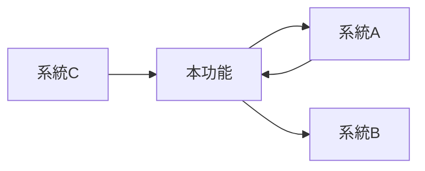

# SDD 遊戲開發流程（Agent + SpecKit 強制整合版）

## 輸入參數
功能描述: $ARGUMENTS

---

## 🚨 強制執行規則

1. **每個步驟都必須同時**：
   - 切換到指定的 Agent 角色（遵循該 Agent 的專業知識和規範）
   - 執行對應的 SpecKit 指令
2. **必須產出檔案** - 每個步驟都有必須建立的檔案
3. **必須按順序執行** - 不可跳過
4. **必須等待確認** - 每步完成後等待「繼續」

---

## 流程概覽

```
┌──────────────────────────────────────────────────────────────────┐
│              SDD 開發流程 (Agent + SpecKit 整合版)                 │
├──────────────────────────────────────────────────────────────────┤
│                                                                  │
│  Step 0: Constitution                                            │
│     Agent: -                                                     │
│     指令: /speckit.constitution                                  │
│     產出: constitution.md                                        │
│                                                                  │
│  Step 1: Design                                                  │
│     Agent: game-designer 🎮                                      │
│     指令: (手動建立)                                              │
│     產出: .claude/shared/designs/[feature]-design.md             │
│                                                                  │
│  Step 2: Specify                                                 │
│     Agent: spec-writer 📝                                        │
│     指令: /speckit.specify                                       │
│     產出: spec.md                                                │
│                                                                  │
│  Step 3: Clarify                                                 │
│     Agent: spec-writer 📝                                        │
│     指令: /speckit.clarify                                       │
│     產出: 更新 spec.md                                           │
│                                                                  │
│  Step 4: Plan                                                    │
│     Agent: tech-planner 🔧 + architect 🏗️                        │
│     指令: /speckit.plan                                          │
│     產出: plan.md, research.md, data-model.md                    │
│                                                                  │
│  Step 5: Tasks                                                   │
│     Agent: task-breakdown 📋                                     │
│     指令: /speckit.tasks                                         │
│     產出: tasks.md                                               │
│                                                                  │
│  Step 6: Implement                                               │
│     Agent: implementer 💻 + qa-tester 🧪                         │
│     指令: /speckit.implement                                     │
│     產出: 程式碼 + 測試                                          │
│                                                                  │
│  Step 7: Analyze                                                 │
│     Agent: quality-reviewer ✅                                   │
│     指令: /speckit.analyze                                       │
│     產出: 一致性報告                                             │
│                                                                  │
└──────────────────────────────────────────────────────────────────┘
```

---

## Step 0: Constitution

### Agent 角色：無（直接執行）
### SpecKit 指令：`/speckit.constitution`

### 執行動作：

1. **檢查 constitution 是否存在**：
```bash
cat .specify/memory/constitution.md 2>/dev/null || echo "NOT_FOUND"
```

2. **如果不存在，執行**：
```
/speckit.constitution 建立遊戲專案開發原則：
- 程式碼品質：可讀性優先、XML 文件註解、無編譯警告
- 測試要求：商業邏輯必須有單元測試、覆蓋率 80%+、TDD 優先
- 命名規範：類別 PascalCase、私有欄位 _camelCase、方法 PascalCase
- 架構原則：依賴注入、介面優先、SOLID 原則
- 錯誤處理：Result Pattern、Exception 只用於真正例外
- 遊戲特定：避免遊戲迴圈中 GC 分配、使用 Object Pool
```

3. **建立目錄**：
```bash
mkdir -p .claude/shared/designs
```

### 必須確認：
- [ ] `.specify/memory/constitution.md` 存在
- [ ] 目錄結構已建立

### 完成輸出：
```
✅ Step 0: Constitution 完成
📄 檔案: .specify/memory/constitution.md ✓
➡️ 輸入「繼續」進入 Step 1: Design
```

---

## Step 1: Design

### Agent 角色：🎮 game-designer（遊戲設計師）
### SpecKit 指令：無（手動建立檔案）

> 🎮 **切換到 game-designer 角色**
> 
> 你現在是資深遊戲設計師，專精於：
> - 遊戲機制設計
> - 數值平衡
> - 玩家體驗設計
> - 核心循環設計
> 
> 參考 `.claude/agents/game-designer.md` 的完整指引。

### 執行動作：

1. **閱讀參考文件**：
```bash
cat .specify/memory/constitution.md
cat .claude/shared/game-design-doc.md 2>/dev/null || echo "無整體設計文件"
```

2. **以 game-designer 角色分析功能需求**：
   - 這個功能在遊戲中的定位是什麼？
   - 核心玩法循環是什麼？
   - 數值如何設計才平衡？
   - 玩家會獲得什麼體驗？

3. **建立設計文件**（使用 create_file）：

### 必須建立的檔案：

**路徑**: `.claude/shared/designs/[feature]-design.md`

```markdown
# [功能名稱] 遊戲設計

> 📅 設計日期: [日期]
> 🎮 設計者: game-designer agent

## 設計概述
- **功能定位**: [這個功能在遊戲中扮演什麼角色]
- **設計目標**: [想要達成什麼玩家體驗]
- **成功指標**: [如何衡量設計是否成功]

## 核心循環

```
[玩家行動] → [系統回饋] → [獎勵/結果] → [動機強化] → [下一步行動]
     ↑                                                    ↓
     ←←←←←←←←←←←←←←←←←←←←←←←←←←←←←←←←←←←←←←←←←←←←←←←←←←←←
```

**循環說明**: [詳細描述這個循環如何運作]

## 玩法機制

### 機制 1: [機制名稱]
| 項目 | 內容 |
|------|------|
| **描述** | 玩家做什麼操作？ |
| **目的** | 為什麼設計這個機制？ |
| **觸發** | 什麼情況下觸發？ |
| **回饋** | 玩家得到什麼回饋？ |

### 機制 2: [機制名稱]
| 項目 | 內容 |
|------|------|
| **描述** | |
| **目的** | |
| **觸發** | |
| **回饋** | |

（根據功能需要添加更多機制）

## 數值設計

| 參數名稱 | 數值 | 類型 | 範圍 | 設計理由 |
|---------|------|------|------|---------|
| | | | | |

### 數值公式（如有）
```
[公式名稱] = [公式]
例如：傷害 = 攻擊力 * (1 - 防禦率)
```

## 玩家體驗設計

### 情緒曲線
```
體驗強度
    ↑
    │    ╭─╮
    │   ╱   ╲     ╭──╮
    │  ╱     ╲   ╱    ╲
    │ ╱       ╲─╯      ╲
    │╱                   ╲
    └──────────────────────→ 時間
      初次  熟悉  精通  挑戰
```

### 新手體驗
- **首次接觸**: [玩家第一次使用時的體驗]
- **學習曲線**: [預期學習時間]
- **引導方式**: [如何教玩家使用]

### 進階體驗
- **深度玩法**: [熟練後的進階操作]
- **精通目標**: [專家級玩家的追求]

## 與其他系統互動



| 系統 | 互動類型 | 說明 |
|------|---------|------|
| [系統A] | 輸出到 | |
| [系統B] | 接收從 | |

## 風險評估

| 風險 | 機率 | 影響 | 緩解方式 |
|------|------|------|---------|
| | 高/中/低 | 高/中/低 | |

---

## 📋 給 SpecKit 的輸入（Step 2 使用）

> ⚠️ 以下內容將直接作為 `/speckit.specify` 的輸入

**功能名稱**: [名稱]

**功能描述**: 
[一段完整的自然語言描述，包含功能目的和核心價值]

**使用者操作**:
1. [操作1]: [描述] - [觸發方式]
2. [操作2]: [描述] - [觸發方式]
3. [操作3]: [描述] - [觸發方式]

**數值規格**:
- [參數1]: [值] ([範圍])
- [參數2]: [值] ([範圍])

**邊界情況**:
- 當 [情況1] 時 → [處理方式]
- 當 [情況2] 時 → [處理方式]
- 當 [情況3] 時 → [處理方式]

**成功標準**:
- [標準1]
- [標準2]
```

### 必須確認：
- [ ] 檔案已建立：`.claude/shared/designs/[feature]-design.md`
- [ ] 包含完整的「給 SpecKit 的輸入」區塊
- [ ] 每個機制都有詳細描述

### 完成輸出：
```
✅ Step 1: Design 完成 (by game-designer 🎮)
📄 檔案: .claude/shared/designs/[feature]-design.md ✓
📊 機制數: X 個
📊 數值參數: X 個
📋 SpecKit 輸入已準備

➡️ 輸入「繼續」進入 Step 2: Specify
```

---

## Step 2: Specify

### Agent 角色：📝 spec-writer（規格撰寫專家）
### SpecKit 指令：`/speckit.specify`

> 📝 **切換到 spec-writer 角色**
> 
> 你現在是規格撰寫專家，專精於：
> - 用戶故事撰寫
> - 驗收標準定義
> - Edge Cases 識別
> - 需求分析
> 
> 參考 `.claude/agents/spec-writer.md` 的完整指引。

### 執行動作：

1. **閱讀設計文件**：
```bash
cat .claude/shared/designs/[feature]-design.md
```

2. **提取「給 SpecKit 的輸入」區塊內容**

3. **以 spec-writer 角色審視設計**：
   - 設計是否有模糊之處？
   - 是否有遺漏的 Edge Cases？
   - 驗收標準是否可測試？

4. **執行 SpecKit 指令**：
```
/speckit.specify [貼上「給 SpecKit 的輸入」區塊的完整內容]
```

5. **以 spec-writer 角色審查產出**：
   - 確認 SpecKit 產出的規格涵蓋所有設計機制
   - 補充遺漏的 Edge Cases
   - 確認驗收標準足夠具體

### SpecKit 產出：
- `.specify/specs/[NNN]-[feature]/spec.md`

### spec-writer 補充（如需要）：
如果 SpecKit 產出有遺漏，以 spec-writer 角色補充：
- 額外的 Edge Cases
- 更詳細的驗收標準
- 設計文件中的數值規格

### 必須確認：
- [ ] `/speckit.specify` 已執行
- [ ] `spec.md` 已產生
- [ ] 規格涵蓋設計文件中的所有機制
- [ ] 每個用戶故事都有驗收標準

### 完成輸出：
```
✅ Step 2: Specify 完成
   📝 Agent: spec-writer
   🔧 指令: /speckit.specify
📄 檔案: .specify/specs/[NNN]-[feature]/spec.md ✓
📊 用戶故事: X 個
📊 驗收標準: X 個
📊 Edge Cases: X 個

➡️ 輸入「繼續」進入 Step 3: Clarify
   或輸入「跳過」直接進入 Step 4: Plan
```

---

## Step 3: Clarify（可選）

### Agent 角色：📝 spec-writer（規格撰寫專家）
### SpecKit 指令：`/speckit.clarify`

> 📝 **維持 spec-writer 角色**

### 執行動作：

1. **執行 SpecKit 指令**：
```
/speckit.clarify
```

2. **以 spec-writer 角色回答問題**：
   - 使用設計文件中的資訊回答
   - 確保答案與設計意圖一致

3. **SpecKit 會更新 spec.md**

### 何時跳過：
- 設計文件非常詳細
- spec.md 已經足夠清晰
- 沒有模糊的需求

### 必須確認：
- [ ] `/speckit.clarify` 已執行（或明確跳過）
- [ ] 所有問題都已回答

### 完成輸出：
```
✅ Step 3: Clarify 完成
   📝 Agent: spec-writer
   🔧 指令: /speckit.clarify
📄 更新: spec.md
📊 釐清問題: X 個

➡️ 輸入「繼續」進入 Step 4: Plan
```

---

## Step 4: Plan

### Agent 角色：🔧 tech-planner + 🏗️ architect
### SpecKit 指令：`/speckit.plan`

> 🔧 **切換到 tech-planner + architect 角色**
> 
> 你現在同時是：
> - **tech-planner**: 技術規劃專家（技術選型、實作計畫）
> - **architect**: 系統架構師（架構設計、設計模式）
> 
> 參考對應的 agent 檔案獲取完整指引。

### 執行動作：

1. **閱讀規格文件**：
```bash
cat .specify/specs/[NNN]-[feature]/spec.md
```

2. **以 tech-planner 角色準備技術棧描述**

3. **以 architect 角色考慮架構設計**：
   - 應該使用什麼設計模式？
   - 模組如何劃分？
   - 依賴關係如何設計？

4. **執行 SpecKit 指令**：
```
/speckit.plan 使用 C# 12 和 [Unity/Godot/.NET] 開發。

架構要求（by architect）：
- 使用 [設計模式，如 Repository Pattern, Service Layer]
- 模組劃分：[Service, Repository, Model]
- 依賴注入：Microsoft.Extensions.DependencyInjection

技術要求（by tech-planner）：
- 錯誤處理：Result Pattern
- 測試框架：xUnit + FluentAssertions + Moq
- 程式碼規範：遵循 constitution.md

效能考量：
- [列出效能相關考量]
```

5. **以 architect 角色審查產出**：
   - 架構是否符合 SOLID？
   - 是否有過度設計？
   - 依賴是否合理？

### SpecKit 產出：
- `.specify/specs/[NNN]-[feature]/plan.md`
- `.specify/specs/[NNN]-[feature]/research.md`
- `.specify/specs/[NNN]-[feature]/data-model.md`

### 必須確認：
- [ ] `/speckit.plan` 已執行
- [ ] `plan.md` 已產生
- [ ] 架構設計符合 constitution
- [ ] 已考慮效能因素

### 完成輸出：
```
✅ Step 4: Plan 完成
   🔧 Agent: tech-planner + architect
   🔧 指令: /speckit.plan
📄 檔案:
   - plan.md ✓
   - research.md ✓
   - data-model.md ✓
📊 模組數: X 個
📊 Phase 數: X 個

➡️ 輸入「繼續」進入 Step 5: Tasks
```

---

## Step 5: Tasks

### Agent 角色：📋 task-breakdown（任務分解專家）
### SpecKit 指令：`/speckit.tasks`

> 📋 **切換到 task-breakdown 角色**
> 
> 你現在是任務分解專家，專精於：
> - 大功能拆分為小任務
> - 依賴關係分析
> - 並行任務識別
> - 工作量估算
> 
> 參考 `.claude/agents/task-breakdown.md` 的完整指引。

### 執行動作：

1. **閱讀計畫文件**：
```bash
cat .specify/specs/[NNN]-[feature]/plan.md
```

2. **以 task-breakdown 角色分析**：
   - 哪些任務可以並行？
   - 依賴順序是什麼？
   - 每個任務的粒度是否適當？

3. **執行 SpecKit 指令**：
```
/speckit.tasks
```

4. **以 task-breakdown 角色審查產出**：
   - 任務粒度是否適當（15-60 分鐘）？
   - TDD 任務是否在實作前？
   - 檢查點是否合理？

### SpecKit 產出：
- `.specify/specs/[NNN]-[feature]/tasks.md`

### 必須確認：
- [ ] `/speckit.tasks` 已執行
- [ ] `tasks.md` 已產生
- [ ] 任務有依賴順序
- [ ] 有標記並行任務 `[P]`
- [ ] 有 TDD 任務標記

### 完成輸出：
```
✅ Step 5: Tasks 完成
   📋 Agent: task-breakdown
   🔧 指令: /speckit.tasks
📄 檔案: tasks.md ✓
📊 總任務: X 個
📊 並行任務: X 個
📊 TDD 任務: X 個

➡️ 輸入「繼續」進入 Step 6: Implement
```

---

## Step 6: Implement

### Agent 角色：💻 implementer + 🧪 qa-tester
### SpecKit 指令：`/speckit.implement`

> 💻🧪 **切換到 implementer + qa-tester 角色**
> 
> 你現在同時是：
> - **implementer**: 實作專家（程式碼撰寫）
> - **qa-tester**: 測試專家（測試撰寫、TDD）
> 
> 參考對應的 agent 檔案獲取完整指引。

### 執行動作：

1. **閱讀任務清單**：
```bash
cat .specify/specs/[NNN]-[feature]/tasks.md
```

2. **執行 SpecKit 指令**：
```
/speckit.implement
```

3. **過程中以雙角色協作**：

   **對於 TDD 任務**：
   - 🧪 qa-tester 先寫測試
   - 💻 implementer 再寫實作
   - 🧪 qa-tester 驗證測試通過

   **對於一般任務**：
   - 💻 implementer 撰寫程式碼
   - 🧪 qa-tester 補充測試

4. **每個任務完成後**：
```bash
dotnet build
dotnet test
```

### SpecKit 產出：
- `src/[Feature]/...` 程式碼
- `tests/[Feature]Tests/...` 測試

### 必須確認：
- [ ] `/speckit.implement` 已執行
- [ ] 所有任務完成
- [ ] 所有測試通過
- [ ] 程式碼符合 constitution 規範

### 完成輸出：
```
✅ Step 6: Implement 完成
   💻 Agent: implementer + qa-tester
   🔧 指令: /speckit.implement
📄 程式碼: src/[Feature]/ ✓
📄 測試: tests/[Feature]Tests/ ✓
📊 任務完成: X/X
📊 測試結果: X passed, 0 failed

➡️ 輸入「繼續」進入 Step 7: Analyze
```

---

## Step 7: Analyze

### Agent 角色：✅ quality-reviewer（品質審查專家）
### SpecKit 指令：`/speckit.analyze`

> ✅ **切換到 quality-reviewer 角色**
> 
> 你現在是品質審查專家，專精於：
> - 規格符合度驗證
> - 程式碼品質審查
> - 一致性檢查
> - 最終驗收
> 
> 參考 `.claude/agents/quality-reviewer.md` 的完整指引。

### 執行動作：

1. **執行 SpecKit 指令**：
```
/speckit.analyze
```

2. **以 quality-reviewer 角色進行驗收**：

   **規格符合度**：
   - 對照 spec.md 的每個驗收標準
   - 確認功能行為符合預期

   **程式碼品質**：
   - 是否符合 constitution？
   - 命名是否清晰？
   - 是否有 Code Smells？

   **測試品質**：
   - 覆蓋率是否足夠？
   - 測試案例是否有意義？

3. **產出驗收報告**（如 SpecKit 沒有自動產出）：

### 必須確認：
- [ ] `/speckit.analyze` 已執行
- [ ] 一致性檢查通過
- [ ] 所有驗收標準都滿足
- [ ] 程式碼品質符合標準

### 完成輸出：
```
✅ Step 7: Analyze 完成
   ✅ Agent: quality-reviewer
   🔧 指令: /speckit.analyze
📊 一致性: 通過 ✓
📊 驗收標準: X/X 通過 ✓
📊 程式碼品質: 通過 ✓

🎉 SDD 流程完成！
```

---

## 最終產出總覽

```
🎉 SDD + Agent + SpecKit 流程完成！

📁 產出檔案:
├── .specify/memory/
│   └── constitution.md                    ← Step 0
│
├── .claude/shared/designs/
│   └── [feature]-design.md                ← Step 1 (game-designer 🎮)
│
├── .specify/specs/[NNN]-[feature]/
│   ├── spec.md                            ← Step 2 (spec-writer 📝)
│   ├── plan.md                            ← Step 4 (tech-planner 🔧 + architect 🏗️)
│   ├── research.md                        ← Step 4
│   ├── data-model.md                      ← Step 4
│   └── tasks.md                           ← Step 5 (task-breakdown 📋)
│
├── src/[Feature]/                         ← Step 6 (implementer 💻 + qa-tester 🧪)
│   ├── Interfaces/
│   ├── Models/
│   └── Services/
│
└── tests/[Feature]Tests/                  ← Step 6
    └── ...

📊 執行紀錄:
| Step | Agent | SpecKit 指令 | 狀態 |
|------|-------|-------------|------|
| 0 | - | /speckit.constitution | ✅ |
| 1 | game-designer 🎮 | (手動) | ✅ |
| 2 | spec-writer 📝 | /speckit.specify | ✅ |
| 3 | spec-writer 📝 | /speckit.clarify | ✅ |
| 4 | tech-planner 🔧 + architect 🏗️ | /speckit.plan | ✅ |
| 5 | task-breakdown 📋 | /speckit.tasks | ✅ |
| 6 | implementer 💻 + qa-tester 🧪 | /speckit.implement | ✅ |
| 7 | quality-reviewer ✅ | /speckit.analyze | ✅ |
```

---

## 流程控制

| 輸入 | 效果 |
|------|------|
| `繼續` | 進入下一步 |
| `調整` | 修改當前步驟的產出 |
| `重做` | 重新執行當前步驟 |
| `回到 Step X` | 回到指定步驟 |
| `狀態` | 顯示當前進度 |
| `跳過` | 跳過 Step 3（僅限 Clarify） |

---

## Agent 與 SpecKit 整合表

| 步驟 | Agent 角色 | SpecKit 指令 | 產出 |
|------|-----------|-------------|------|
| Step 0 | - | `/speckit.constitution` | `constitution.md` |
| Step 1 | 🎮 game-designer | (手動) | `*-design.md` |
| Step 2 | 📝 spec-writer | `/speckit.specify` | `spec.md` |
| Step 3 | 📝 spec-writer | `/speckit.clarify` | 更新 `spec.md` |
| Step 4 | 🔧 tech-planner + 🏗️ architect | `/speckit.plan` | `plan.md`, `research.md` |
| Step 5 | 📋 task-breakdown | `/speckit.tasks` | `tasks.md` |
| Step 6 | 💻 implementer + 🧪 qa-tester | `/speckit.implement` | 程式碼 + 測試 |
| Step 7 | ✅ quality-reviewer | `/speckit.analyze` | 一致性報告 |

---

## 開始執行

功能描述: **$ARGUMENTS**

我將從 Step 0 開始，每個步驟都會：
1. 切換到對應的 Agent 角色
2. 執行對應的 SpecKit 指令
3. 確認產出檔案
4. 等待你確認後繼續

**準備好了嗎？讓我們開始！**
