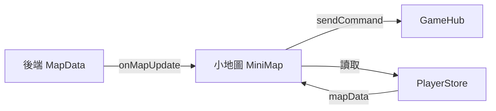

# 小地圖優化 遊戲設計

> 📅 設計日期: 2025-12-30
> 🎮 設計者: game-designer agent

## 設計概述
- **功能定位**: 小地圖是玩家導航和探索的核心輔助系統，提供空間感知和方向指引
- **設計目標**: 優化現有小地圖的 UI/UX，增強互動性，修正已知 Bug，提升玩家導航體驗
- **成功指標**:
  - 玩家能一眼辨識所有可用出口方向
  - 支援點擊出口快速移動
  - 危險區域有明確視覺警告
  - 所有 6 個方向（東西南北上下）正確顯示

## 現有系統分析

### 已實作功能
| 功能 | 狀態 | 說明 |
|------|------|------|
| 4 方向顯示 (東西南北) | ✅ | 正常運作 |
| 當前房間名稱 | ✅ | 正常運作 |
| 怪物數量警告 | ✅ | 正常運作 |
| 出口列表文字 | ✅ | 正常運作 |
| SVG 動畫效果 | ✅ | 玩家位置脈動效果 |

### 發現的問題/Bug
| 問題 | 嚴重度 | 說明 |
|------|--------|------|
| 上/下方向未顯示 | 🔴 高 | directionPositions 已定義但 v-for 只遍歷 4 方向 |
| 相鄰房間怪物警告未使用 | 🟡 中 | ExitInfo.hasMonsters 欄位存在但未視覺化 |
| 出口無法點擊移動 | 🟡 中 | 缺少互動功能 |
| 房間描述未顯示 | 🟢 低 | RoomInfo.description 未使用 |

## 核心循環

```
[查看小地圖] → [識別出口方向] → [判斷安全性] → [選擇移動方向] → [到達新房間]
     ↑                                                               ↓
     ←←←←←←←←←←←←←←←←←←←←←←←←←←←←←←←←←←←←←←←←←←←←←←←←←←←←←←←←←←←←
```

**循環說明**: 玩家持續通過小地圖感知環境，做出導航決策，形成探索遊戲世界的持續循環。

## 玩法機制

### 機制 1: 六方向出口顯示
| 項目 | 內容 |
|------|------|
| **描述** | 在小地圖上顯示所有 6 個可能的出口方向 |
| **目的** | 讓玩家完整了解移動選項，包含上下層概念 |
| **觸發** | 進入新房間時自動更新 |
| **回饋** | 有出口的方向顯示綠色連接線和圓圈，無出口顯示灰色虛線 |

### 機制 2: 危險區域警告
| 項目 | 內容 |
|------|------|
| **描述** | 當相鄰房間有怪物時，出口顯示紅色警告 |
| **目的** | 讓玩家在移動前知道潛在危險 |
| **觸發** | ExitInfo.hasMonsters === true |
| **回饋** | 出口節點變紅色，懸停顯示「有怪物出沒」提示 |

### 機制 3: 快速移動互動
| 項目 | 內容 |
|------|------|
| **描述** | 點擊小地圖上的出口節點可直接移動 |
| **目的** | 減少輸入指令的繁瑣，提升操作效率 |
| **觸發** | 點擊有效出口節點 |
| **回饋** | 觸發對應方向的移動指令，視覺上有點擊反饋 |

### 機制 4: 房間資訊展示
| 項目 | 內容 |
|------|------|
| **描述** | 顯示當前房間的完整資訊 |
| **目的** | 提供環境敘事，增強沉浸感 |
| **觸發** | 進入房間時顯示 |
| **回饋** | 房間名稱 + 簡短描述（可摺疊） |

## 數值設計

| 參數名稱 | 數值 | 類型 | 範圍 | 設計理由 |
|---------|------|------|------|---------|
| SVG 尺寸 | 200x200 | px | 固定 | 維持現有尺寸，經過測試適合 |
| 中心點位置 | (100,100) | px | - | SVG 中心 |
| 出口節點半徑 | 12 | px | 10-15 | 足夠大便於點擊 |
| 玩家節點半徑 | 16 | px | 14-18 | 動畫範圍 |
| 連接線粗細 | 2 | px | 2-3 | 清晰可見 |

### 方向位置座標
```
方向: { x, y }
north: { 100, 40 }   // 正上方
south: { 100, 160 }  // 正下方
east:  { 160, 100 }  // 正右方
west:  { 40, 100 }   // 正左方
up:    { 140, 40 }   // 右上角 (代表上層)
down:  { 60, 160 }   // 左下角 (代表下層)
```

## 玩家體驗設計

### 情緒曲線
```
體驗強度
    ↑
    │    ╭─╮     危險警告
    │   ╱   ╲    (緊張)
    │  ╱     ╲───安全導航
    │ ╱           (舒適)
    │╱
    └──────────────────────→ 時間
      看地圖  判斷  移動
```

### 新手體驗
- **首次接觸**: 看到直覺的羅盤式導航，中心的「你」字清楚標示位置
- **學習曲線**: 幾乎無學習成本，符合常見遊戲小地圖直覺
- **引導方式**: 通過顏色（綠=安全出口, 紅=危險, 灰=不可通行）自然引導

### 進階體驗
- **深度玩法**: 利用危險警告規劃安全路線
- **精通目標**: 快速識別地形，優化探索效率

## 視覺設計規範

### 顏色系統
| 元素 | 顏色 | 十六進位 | 用途 |
|------|------|---------|------|
| 安全出口 | 綠色 | #4ade80 | 無怪物的出口 |
| 危險出口 | 紅色 | #ef4444 | 有怪物的出口 |
| 無出口 | 灰色 | #374151 | 該方向無法通行 |
| 玩家位置 | 藍色 | #3b82f6 | 中心點 |
| 上/下標記 | 紫色 | #a855f7 | 區分樓層概念 |

### 互動狀態
| 狀態 | 視覺效果 |
|------|---------|
| 預設 | 原始顏色 |
| 懸停 | 背景變亮，顯示 tooltip |
| 點擊 | 短暫縮放動畫 |
| 禁用 | 半透明灰色 |

## 與其他系統互動



| 系統 | 互動類型 | 說明 |
|------|---------|------|
| PlayerStore | 讀取 | 獲取 mapData（currentRoom, exits） |
| GameHub | 輸出 | 發送移動指令（go north, go south 等） |
| 後端 | 接收 | 透過 SignalR 接收地圖更新 |

## 風險評估

| 風險 | 機率 | 影響 | 緩解方式 |
|------|------|------|---------|
| 點擊移動與輸入指令衝突 | 低 | 低 | 使用相同的 sendCommand API |
| 上下方向視覺不直覺 | 中 | 中 | 使用梯子/箭頭圖示輔助理解 |
| 移動動畫延遲 | 低 | 低 | 樂觀更新 UI |

---

## 📋 給 SpecKit 的輸入（Step 2 使用）

> ⚠️ 以下內容將直接作為 `/speckit.specify` 的輸入

**功能名稱**: 小地圖優化 (MiniMap Enhancement)

**功能描述**:
優化現有小地圖組件的 UI/UX，修正 Bug（上下方向未顯示），增加危險區域警告和快速移動互動功能，提升玩家導航體驗。這是一個對現有功能的增強，而非全新功能。

**使用者操作**:
1. [查看方向]: 玩家查看小地圖，看到所有 6 個方向的出口狀態 - 進入房間自動更新
2. [識別危險]: 玩家通過紅色標記識別有怪物的相鄰房間 - 視覺顏色區分
3. [點擊移動]: 玩家點擊出口節點快速移動到相鄰房間 - 滑鼠點擊出口圓圈
4. [懸停查看]: 玩家懸停出口查看目標房間名稱 - 滑鼠懸停顯示 tooltip

**數值規格**:
- SVG 尺寸: 200x200 px（維持現有）
- 出口節點半徑: 12 px
- 玩家節點半徑: 16 px（動畫範圍 14-18）
- 安全出口顏色: #4ade80（綠色）
- 危險出口顏色: #ef4444（紅色）
- 上下方向顏色: #a855f7（紫色）

**邊界情況**:
- 當房間沒有任何出口時 → 顯示「無出口」文字，所有方向顯示灰色虛線
- 當上/下方向有出口時 → 顯示在右上角(up)/左下角(down)，使用梯子圖示
- 當點擊出口但移動失敗時 → 維持原狀態，依賴後端訊息回饋
- 當戰鬥中點擊出口時 → 正常發送指令（後端會處理戰鬥中無法移動）

**成功標準**:
- 所有 6 個方向（北、南、東、西、上、下）都能正確顯示出口狀態
- hasMonsters=true 的出口顯示紅色警告
- 點擊出口能成功觸發移動指令
- 懸停出口顯示目標房間名稱
- 現有功能（房間名稱、怪物警告、出口列表）維持正常運作
